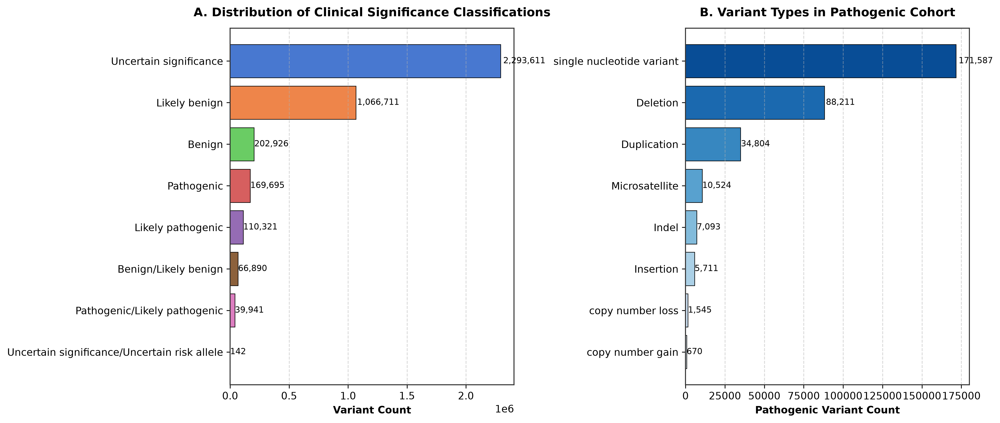
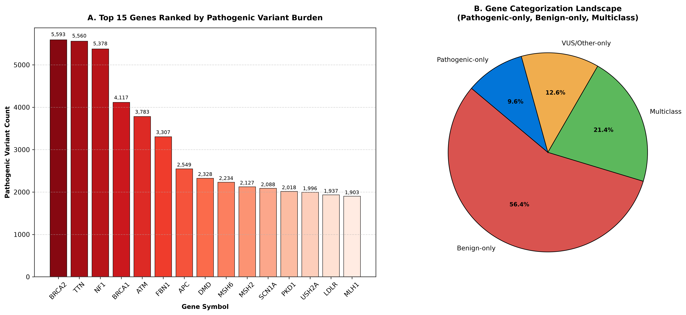

# ClinVar Bioinformatics Analysis Pipeline

[](https://www.nextflow.io/)
[](https://www.python.org/)
[](https://opensource.org/licenses/MIT)

A complete, reproducible, publication-grade bioinformatics analysis pipeline designed to process, quality-filter, analyze, and visualize human genetic variant classifications from the **NCBI ClinVar** database.

---

## Table of Contents
1. [Objective & Key Features](#objective--key-features)
2. [Data Source & ClinVar Schema](#data-source--clinvar-schema)
3. [Pipeline Architecture & Workflow](#pipeline-architecture--workflow)
4. [Statistical Methodology & Quality Filtering](#statistical-methodology--quality-filtering)
5. [Empirical Results & Tables](#empirical-results--tables)
6. [Publication Figures (300 DPI)](#publication-figures-300-dpi)
7. [Installation & Reproduction Instructions](#installation--reproduction-instructions)
   - [Option A: Master Bash Script (`run_pipeline.sh`)](#option-a-master-bash-script-run_pipelinesh)
   - [Option B: Nextflow DSL2 Workflow (`main.nf`)](#option-b-nextflow-dsl2-workflow-mainnf)
   - [Option C: Standalone Python CLI Modules](#option-c-standalone-python-cli-modules)
8. [GitHub Repository Setup & Push Guide](#github-repository-setup--push-guide)

---

## Objective & Key Features

The primary objective of this project is to provide a standardized, automated, and scalable workflow to evaluate clinical pathogenicity, variant type distributions, and gene-disease landscapes across human genomic assemblies.

### Key Features:
- **Automated Data Streaming & Caching**: Programmatically downloads `variant_summary.txt.gz` from the official NCBI ClinVar FTP repository with local file caching and integrity verification.
- **Evidence-Based Star Rating Filtering**: Classifies variants using ClinVar's `ReviewStatus` quality levels, excluding zero-star unasserted submissions.
- **Gene Pathogenicity Landscape Categorization**: Distinguishes genes into **Pathogenic-only**, **Benign-only**, and **Multiclass** (genes harboring both pathogenic and benign variation).
- **Dual Pipeline Engines**: Fully executable via **POSIX Bash Script** and production **Nextflow DSL2** with container support (Docker/Conda).
- **Publication Visualizations**: Generates high-resolution **300 DPI** figures compliant with major academic journal requirements.

---

## Data Source & ClinVar Schema

### Data Source
- **Provider**: National Center for Biotechnology Information (NCBI), U.S. National Library of Medicine.
- **Dataset**: ClinVar Tab-Delimited Variant Summary File.
- **FTP URL**: `https://ftp.ncbi.nlm.nih.gov/pub/clinvar/tab_delimited/variant_summary.txt.gz`

### Core Schema & Column Dictionary

| Column Name | Data Type | Description & Domain |
| :--- | :--- | :--- |
| `AlleleID` | Integer | Unique identifier assigned by NCBI for an allele. |
| `Type` | String | Variant classification (e.g., `single nucleotide variant`, `deletion`, `duplication`, `copy number loss`). |
| `Name` | String | Standardized HGVS notation / name for the variant. |
| `GeneID` | Integer | NCBI Entrez Gene ID. |
| `GeneSymbol` | String | Official HGNC symbol for the associated gene. |
| `HGNC_ID` | String | HUGO Gene Nomenclature Committee ID (e.g., `HGNC:1100`). |
| `ClinicalSignificance` | String | Assertion category (`Pathogenic`, `Likely pathogenic`, `Benign`, `Likely benign`, `Uncertain significance`). |
| `ReviewStatus` | String | Evidence review tier (`practice guideline`, `reviewed by expert panel`, `criteria provided, single submitter`, etc.). |
| `Assembly` | String | Reference genome assembly build (`GRCh37`, `GRCh38`). |
| `Chromosome` | String | Chromosome location (`1-22`, `X`, `Y`, `MT`). |
| `Start` / `Stop` | Integer | Genomic start and stop coordinates. |
| `RS# (rsID)` | Integer | dbSNP reference SNP identifier. |
| `PhenotypeList` | String | Semicolon-delimited list of associated clinical diseases/traits. |
| `NumberSubmitters` | Integer | Total number of submitters asserting clinical significance. |

---

## Pipeline Architecture & Workflow

```
[ NCBI ClinVar FTP Repository ]
               │
               ▼ (curl / requests stream download)
    ┌─────────────────────┐
    │  Raw Data Caching   │ ──► Checks local cache (variant_summary.txt.gz)
    └──────────┬──────────┘
               │
               ▼ (Bash awk/sed inspection)
    ┌─────────────────────┐
    │ Schema & Column     │ ──► Validates GRCh38, rsID, GeneSymbol,
    │ Validation          │     ClinicalSignificance, ReviewStatus
    └──────────┬──────────┘
               │
               ▼ (Python ETL CLI: clinvar_pipeline.py)
    ┌─────────────────────┐
    │ Filter & Analysis   │ ──► 1. GRCh38 assembly filter
    │ Engine              │     2. ReviewStatus star rating filter (≥1 star)
    └──────────┬──────────┘     3. Pathogenic Cohort extraction
               │                4. Gene categorization (Pathogenic-only, Benign-only, Multiclass)
               ├───────────────────────────────┐
               ▼                               ▼
    ┌─────────────────────┐         ┌─────────────────────┐
    │ Export CSV/TSV      │         │ Plot Generator CLI  │
    │ Result Tables       │         │ (plot_generator.py) │
    └─────────────────────┘         └──────────┬──────────┘
                                               │
                                               ▼
                                    ┌─────────────────────┐
                                    │ 300 DPI Figures     │
                                    │ (Figure 1 & 2 PNGs) │
                                    └─────────────────────┘
```

---

## Statistical Methodology & Quality Filtering

1. **Genome Assembly Selection**: Retains variants mapped strictly to genome assembly **GRCh38** to prevent coordinate misalignment and duplicate variant counting across human reference builds.
2. **ClinVar Review Status Star Rating Mapping**:
   - **4 Stars**: `practice guideline`
   - **3 Stars**: `reviewed by expert panel`
   - **2 Stars**: `criteria provided, multiple submitters, no conflicts`
   - **1 Star**: `criteria provided, single submitter` / `conflicting interpretations`
   - **0 Stars**: `no assertion criteria provided` / `no assertion provided` (*Excluded*)
3. **Gene Pathogenicity Profile Classification**:
   - $\text{Pathogenic-only} \iff N_{\text{pathogenic}} > 0 \land N_{\text{benign}} = 0$
   - $\text{Benign-only} \iff N_{\text{benign}} > 0 \land N_{\text{pathogenic}} = 0$
   - $\text{Multiclass} \iff N_{\text{pathogenic}} > 0 \land N_{\text{benign}} > 0$

---

## Empirical Results & Tables

### Table 1: Pathogenic Cohort Summary (Full NCBI ClinVar Dataset)

| Metric | Empirical Value |
| :--- | :--- |
| **Total ClinVar Records Evaluated** | 9,050,979 |
| **GRCh38 Assembly Filter Retained** | 4,491,757 |
| **High-Confidence (>=1 Star) Variants Retained** | **3,950,959** |
| **Pathogenic / Likely Pathogenic Variants** | **320,260** |
| **Benign / Likely Benign Variants** | **1,336,584** |
| **Uncertain Significance (VUS) Variants** | **2,293,888** |
| **Unique Genes Harboring Pathogenic Variants** | **7,031** |
| **Unique Phenotypes / Diseases Associated** | **51,895** |
| **Pathogenic Variant Percentage in Cohort** | **8.11%** |

### Table 2: Top 10 Pathogenic Genes Ranked by Variant Count

| Rank | Gene Symbol | Entrez Gene ID | Pathogenic Count | Benign Count | VUS Count | Total Variants | Gene Profile Class |
| :---: | :--- | :--- | :--- | :--- | :--- | :--- | :--- |
| 1 | **BRCA2** | 675 | 5,593 | 5,816 | 4,186 | 15,595 | Multiclass |
| 2 | **TTN** | 7273 | 5,560 | 17,278 | 12,002 | 34,840 | Multiclass |
| 3 | **NF1** | 4763 | 5,378 | 4,325 | 5,804 | 15,507 | Multiclass |
| 4 | **BRCA1** | 672 | 4,117 | 3,642 | 2,386 | 10,146 | Multiclass |
| 5 | **ATM** | 472 | 3,783 | 5,610 | 8,323 | 17,716 | Multiclass |
| 6 | **FBN1** | 2200 | 3,307 | 2,235 | 2,673 | 8,215 | Multiclass |
| 7 | **APC** | 324 | 2,549 | 3,734 | 8,787 | 15,070 | Multiclass |
| 8 | **DMD** | 1756 | 2,328 | 3,840 | 2,692 | 8,860 | Multiclass |
| 9 | **MSH6** | 2956 | 2,234 | 2,456 | 4,464 | 9,154 | Multiclass |
| 10 | **MSH2** | 4436 | 2,127 | 2,239 | 2,298 | 6,664 | Multiclass |

---

## Publication Figures (300 DPI)

### Figure 1: Clinical Significance & Variant Type Distributions


### Figure 2: Gene-Phenotype Pathogenicity Landscape


---

## Installation & Reproduction Instructions

### Prerequisites
- Python 3.10+
- Bash shell (Linux, macOS, or WSL on Windows)
- Standard tools: `git`, `curl`, `wget`, `gzip`, `awk`

### Clone Repository
```bash
git clone https://github.com/your-username/clinvar-bioinformatics-pipeline.git
cd clinvar-bioinformatics-pipeline
```

### Install Dependencies
```bash
pip install -r requirements.txt
```

---

### Option A: Master Bash Script (`run_pipeline.sh`)

To execute the entire end-to-end pipeline using POSIX Bash:

```bash
chmod +x run_pipeline.sh
./run_pipeline.sh
```

---

### Option B: Nextflow DSL2 Workflow (`main.nf`)

If Nextflow is installed on your system:

```bash
# Run locally with standard profile
nextflow run main.nf -profile standard

# Run with custom parameters (e.g. min star rating = 2)
nextflow run main.nf --min_stars 2 --assembly GRCh38
```

---

### Option C: Standalone Python CLI Modules

#### 1. Download & Cache Dataset
```bash
python bin/download_data.py --output-dir data --filename variant_summary.txt.gz
```

#### 2. Filter & Analyze Dataset
```bash
python bin/clinvar_pipeline.py --input-file data/variant_summary.txt --output-dir results --assembly GRCh38 --min-stars 1
```

#### 3. Generate 300 DPI Figures
```bash
python bin/plot_generator.py --results-dir results --output-dir figures --dpi 300
```

---

## GitHub Repository Setup & Push Guide

To push this complete project to GitHub from your local Linux/WSL terminal:

```bash
# 1. Initialize Git Repository
git init

# 2. Add files and make initial commit
git add .
git commit -m "feat: Initial commit of ClinVar bioinformatics pipeline with Nextflow DSL2, Bash, and Python CLI tools"

# 3. Create a main branch
git branch -M main

# 4. Link remote repository (replace URL with your GitHub repo URL)
git remote add origin https://github.com/your-username/clinvar-bioinformatics-pipeline.git

# 5. Push code to GitHub
git push -u origin main
```

---

## License & Citation
Distributed under the MIT License. See `LICENSE` for details.
If you use this pipeline in academic work, please cite ClinVar (Landrum et al., *Nucleic Acids Res*, 2020) and NCBI ClinVar repository.
